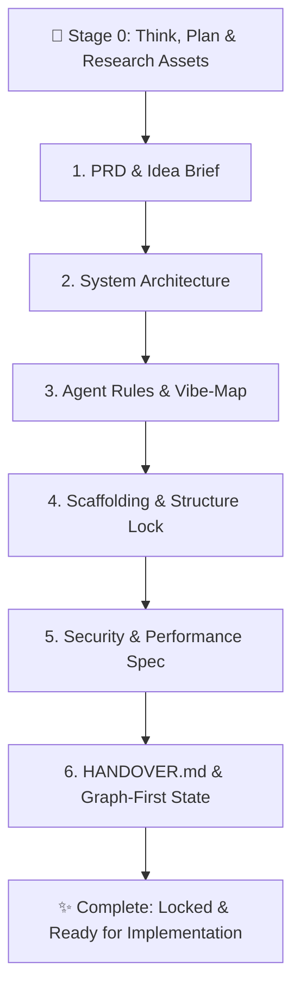

<div align="center">


# 🚀 PI! - Project Initiator

**Universal Pre-Flight Idea Discovery, Architectural Lock & Cross-Agent Handover Protocol**

[](LICENSE)
[](#-cross-platform-compatibility)
[](https://github.com/muchandresh/Vibe-Map)

<p align="center">
  <b>Halt premature code generation.</b> Think first, plan deeply with the user, research assets and brand guidelines, lock canonical directory scaffolding, enforce security budgets, and ensure seamless state handover across AI models and platforms.
</p>

---

</div>

## 💡 What is PI! (Project Initiator)?

When developers prompt AI coding assistants to *"build an app"*, models frequently suffer from **Premature Implementation Disease**:
- They immediately start writing code without clarifying architecture, data models, or brand identity.
- They scatter arbitrary files across ad-hoc directories, creating circular dependencies.
- They ignore security guardrails (hardcoded secrets, raw SQL, unvalidated inputs) and performance budgets.
- When you switch models, switch from GUI to CLI, or hand the project to another developer/agent, **all context is destroyed**.

**`PI!`** establishes an ironclad, pre-flight workflow that runs **before any code is written**, delivering six foundational pillars in strict sequence:



---

## 🏛️ The Six Pre-Flight Pillars

### 🧠 Stage 0: Collaborative Thinking, Planning & Deep Asset Research
- **Thought Alignment:** The agent pauses, outlines a discovery roadmap, and asks all necessary foundational questions upfront.
- **Brand Identity & Aesthetics:** Inquires about brand voice, tone (minimal, neo-brutalist, retro terminal, enterprise clean), and color palettes.
- **Visual Assets & Media:** Prompts user to attach logos, SVG icons, wireframes, Figma designs, or image assets.
- **Reference URL Research:** Inspects provided reference websites/repos using web search or URL reading tools to extract UX patterns and architectural lessons.
- **Custom Requirements:** Uncovers custom business logic, domain algorithms, or compliance constraints (GDPR, HIPAA, SOC2).
- **Plan Synthesis:** Synthesizes all gathered materials and confirms alignment with the user before generating specs.

### 1. `PRD.md` (Product Requirements Document & Project Brief)
- Houses the complete project brief, vision, user personas, problem space, and success criteria.
- Defines Phase 1 MVP (Must-Haves) vs Phase 2 Post-MVP vs **Explicit Non-Goals** to permanently prevent scope creep.
- Visualizes user journeys with interactive Mermaid sequence diagrams.
- Records attached brand assets, color schemes, and reference URLs.

### 2. `ARCHITECTURE.md` (System Design & Technology Blueprint)
- Conducts technical stack discovery (Language, UI, API, Database, Caching, Queue) and provides tailored recommendations.
- Renders full system architecture diagrams in `mermaid`.
- Specifies canonical directory boundaries, data flow pipelines, and strongly-typed schema contracts.

### 3. `AGENTS.md` (Operational Guidelines & `/vibe-map` Integration)
- Defines binding rules for AI agents operating in the repository.
- **Mandatory `/vibe-map` Attachment ([Vibe-Map Repo](https://github.com/muchandresh/Vibe-Map)):** Mandates running `/vibe-map impact` before modifying components and `/vibe-map update` after completing milestones.
- Enforces strict typing, complete implementations (zero TODOs/stubs), and automated test coverage.

### 4. Scaffolding & Structure Lock (`.structure_lock.json`)
- Based on `ARCHITECTURE.md`, physically creates all directories and placeholder files.
- **The Strict Permission Guard:** AI agents are locked strictly to the authorized directory layout.
- **Rule:** If an agent ever needs to create a new file or directory, or access external paths, **it must STOP and ask for explicit user permission first**.

### 5. `SECURITY_AND_PERFORMANCE.md` (Mandatory Guardrails & Budgets)
- Security specifications: Zero hardcoded secrets, mandatory `.env.example`, input validation schemas (Zod/Pydantic), SQL injection prevention, safe error masking.
- Performance budgets: Explicit latency thresholds (API P95 < 100ms), database index rules, memory limits, and frontend bundle caps (< 150KB gzip).

### 6. `HANDOVER.md` (Cross-Model & Platform Continuity State)
- Eliminates context loss when switching between models (Gemini, Claude, GPT, Codex), accounts, or tools (`agy` CLI, Cursor, Windsurf).
- **The Map/Graph First Mandate:** Incoming agents MUST inspect `VIBE_MAP.md` / `codebase_map.json` before writing code.
- Outlines exact completed tasks, in-progress state, blockers, and an ordered priority punch list.

---

## 🐞 Post-Handover Debugging with Vibe-Map History

When switching to a new agent or CLI session, users frequently encounter situations where a newly introduced bug needs immediate debugging. Because `PI!` integrates with [`/vibe-map`](https://github.com/muchandresh/Vibe-Map), incoming agents can pinpoint bug origins in seconds:

1. **Version History & Structural Snapshots:**  
   `vibe-map` maintains structural snapshots across runs. The incoming agent inspects what files and functions were modified right before the error appeared.
2. **Blast Radius Diagnostics:**  
   Run `/vibe-map impact "<modified_file>"` to reveal all dependent modules that may have received broken data contracts.
3. **Execution Path Tracing:**  
   Run `/vibe-map trace "<entry_file>" "<error_file>"` to visualize exactly how execution reached the crashing function.

```bash
# Debugging command workflow for incoming agents:
/vibe-map impact "src/core/engine.ts"       # Inspect blast radius
/vibe-map trace "src/api/user.ts" "src/db" # Trace request to database
/vibe-map update                           # Resync map after fixing bug
```

---

## 🛠️ Git Repository Creation & Pre-Commit Workflow

Once `PI!` finishes the pre-flight scaffolding, initialize your Git repository and lock down structural integrity:

### 1. Initialize & Make Initial Commit

```bash
# Initialize git repository
git init -b main

# Stage all scaffolded files and the structure lock
git add .

# Create initial commit
git commit -m "feat: initial project foundation via PI! (Project Initiator)"

# (Optional) Link to GitHub / remote repository
git remote add origin https://github.com/your-username/your-project-name.git
git push -u origin main
```

### 2. Verify Structural Integrity Anytime

Run the built-in validator to confirm no rogue files or directories were added without permission:

```bash
python3 scripts/init_scaffold.py --verify
# or
python3 scripts/check_lock.py
```

### 3. Grant Permission for New Paths

If the user approves adding a new file or directory, register it in the lockfile:

```bash
python3 scripts/init_scaffold.py --grant "src/services/stripe.ts" --reason "User approved Stripe payment service"
```

---

## 🌐 Cross-Platform Compatibility

| Agent Platform | Collaborative Planning & Discovery | Asset & Reference Research | Scaffolding & Lock Enforcement | Cross-Platform Handover |
| :--- | :--- | :--- | :--- | :--- |
| **Google Antigravity** | Native modal `ask_question` UI | `read_url_content`, Web Search, Artifacts | Native file tools + `init_scaffold.py` + Artifacts | `HANDOVER.md` + `/vibe-map` |
| **Claude Code** | Numbered interactive CLI menus | `WebFetch`, `curl`, local file inspection | Shell execution + `.structure_lock.json` | `HANDOVER.md` + `/vibe-map` |
| **Cursor / Windsurf** | Interactive chat numbered prompts | Chat URL attachments & local file reads | Workspace files + rules enforcement | `HANDOVER.md` + `/vibe-map` |
| **Cline / Roo-Code** | Interactive prompt iterations | Web browser tool / local file tools | Direct tool calls + lockfile verification | `HANDOVER.md` + `/vibe-map` |
| **OpenAI / ChatGPT / Codex** | Structured markdown Q&A rounds | Web browsing tool & image uploads | Canvas / Direct workspace files | `HANDOVER.md` + `/vibe-map` |

---

## ⚡ Quickstart & Triggers

### Natural Language Triggers
- `/project-init` or `/project-initiator`
- `!project-init` or `!init`
- `/handover` or *"Prepare handover"* / *"Switching to CLI / another agent"*
- *"Initialize a new project"*
- *"Start a new project for [idea]"*
- *"Help me plan and initiate my project before building"*
- *"Run project initiator"*

---

## 📦 Universal Installation

### One-Line Install (All Platforms)

```bash
./install.sh --all
```

### Platform-Specific Install

```bash
# Google Antigravity Global Skill
./install.sh --antigravity

# Claude Code Global Skill
./install.sh --claude

# Cursor Rules (.cursor/rules/project-initiator.mdc)
./install.sh --cursor

# Windsurf / Cascade
./install.sh --windsurf

# Attach to a specific workspace
./install.sh --project /path/to/my/project
```

---

## 📂 Repository Layout

```text
project_initiator/
├── assets/
│   └── banner.svg                # Centered high-aesthetic "PI!" banner
├── SKILL.md                      # Main universal skill definition
├── README.md                     # Complete documentation & Git guide
├── install.sh                    # Universal multi-agent installer
├── LICENSE                       # MIT License
├── scripts/
│   ├── init_scaffold.py          # Scaffolding generator & lock verifier
│   └── check_lock.py             # Pre-commit & CI structural checker
├── templates/
│   ├── PRD.template.md           # Gold-standard PRD, Idea & Brand brief
│   ├── ARCHITECTURE.template.md  # System design & architecture template
│   ├── AGENTS.template.md        # Agent rules with /vibe-map & lock rules
│   ├── HANDOVER.template.md      # Cross-model state & Map-First handover
│   ├── SECURITY_AND_PERFORMANCE.template.md # Guardrails & latency budgets
│   └── structure_lock.template.json # JSON structure lock schema
└── references/
    ├── discovery_questions.md    # Phased interactive question sequences
    ├── vibe_map_integration.md   # Blast-radius mapping & debug guide
    └── handover_protocol.md      # Full lifecycle state transfer guide
```

---

## 📜 License

MIT License. Designed with precision for autonomous software development.
