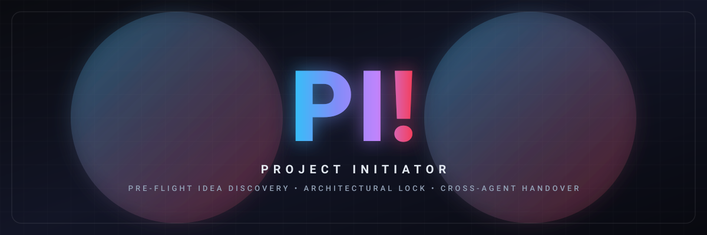
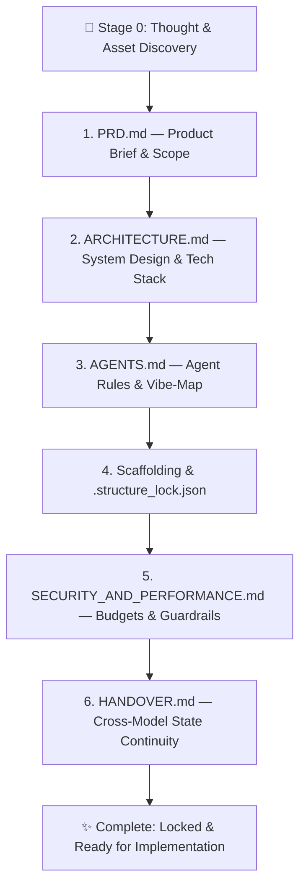

<div align="center">



# 🚀 PI! - Project Initiator

**Universal Pre-Flight Idea Discovery, Architectural Lock & Cross-Agent Handover Protocol**

[](LICENSE)
[](#-how-to-install-the-correct-method)
[](https://github.com/muchandresh/Vibe-Map)

<p align="center">
  <b>The smart way to start any coding project with AI.</b><br>
  Brainstorm your idea, align on architecture, lock clean folders, and keep full project context across every model and tool.
</p>

---

</div>

## ❓ Why It's Needed & Why It's Important

Every developer using AI coding assistants experiences the same frustration: **The AI starts writing code way too fast.**

| ❌ Without PI! (The Chaos) | ✅ With PI! (The Solution) |
| :--- | :--- |
| **Random File Spaghetti:** AI invents arbitrary folder trees and scatters files everywhere. | **Locked Scaffolding:** Pre-creates the canonical folder tree. The AI cannot create new files without your permission. |
| **Ignored Branding & Design:** AI defaults to generic, purple AI templates without asking for brand colors or reference links. | **Asset & Brand Discovery:** Gathers brand voice, color schemes, logos, and reference URLs before touching code. |
| **Vulnerable & Slow:** Forgets rate limits, leaves raw SQL, hardcodes secrets, and ignores latency budgets. | **Security & Performance Guardrails:** Non-negotiable rules for input validation, secrets handling, and sub-100ms budgets. |
| **Broken Context on Switch:** If you switch models (Gemini ➔ Claude), switch accounts, or jump to CLI, the new agent is completely lost. | **Zero-Loss Handover:** Creates a living `HANDOVER.md` so any new agent or CLI picks up immediately with full codebase memory. |

---

## ✨ How Ridiculously Easy It Is

You don't need to configure anything complex. It works as a natural conversation inside your AI chat:

1. **One Trigger:** Type `/project-init` in your chat.
2. **One Interactive Chat:** The AI interviews you like a Senior Architect—asking about your idea, target users, branding, and tech stack preferences.
3. **Automated Generation:** In seconds, PI! creates the 6 foundational project documents and locks your folder structure.
4. **Done:** You now build your features with 100% confidence, zero scope creep, and total architectural clarity.

---

## 📦 How to Install (The Correct Method)

Install PI! once, and it will be available across all your AI assistants globally or inside a single project.

### 🌟 1. One-Line Universal Install (All Agents)

Run this single command in your terminal to install PI! across **Google Antigravity, Claude Code, Cursor, and Windsurf** simultaneously:

```bash
curl -fsSL https://raw.githubusercontent.com/muchandresh/project_initiator/main/install.sh | bash
```

---

### 🎯 2. Platform-Specific Install Options

If you prefer to install only for your primary tool:

#### 🪐 Google Antigravity (Global)
```bash
./install.sh --antigravity
```
*Installs into `~/.gemini/config/skills/project-initiator`.*

#### 🤖 Claude Code (Global)
```bash
./install.sh --claude
```
*Installs into `~/.claude/skills/project-initiator`.*

#### ⚡ Cursor (.cursor/rules)
```bash
./install.sh --cursor
```
*Installs into `~/.cursor/rules/project-initiator.mdc`.*

#### 🌊 Windsurf / Cascade
```bash
./install.sh --windsurf
```
*Installs into `~/.codeium/windsurf/skills/project-initiator`.*

#### 📁 Attach to a Specific Project Only
```bash
./install.sh --project /path/to/your/project
```
*Installs directly into `.agents/skills/project-initiator` inside that project.*

---

## 🚀 What To Do: Step-by-Step Quickstart

### Step 1: Open Your AI Chat & Run the Trigger
Open your favorite agent (Antigravity IDE, `agy` CLI, Claude Code, Cursor) in a new project folder and type:
```text
/project-init
```
*(Or simply say: "Initialize a new project with project initiator")*

---

### Step 2: Answer the Quick Interview
The agent will guide you through a brief, high-value conversation:
- **The Big Idea:** What are you building and who is it for?
- **MVP vs Non-Goals:** What are the 3 must-have features, and what are we strictly NOT building yet?
- **Branding & Assets:** Do you have brand colors, logos, or reference websites to emulate?
- **Tech Stack:** Your preferred language, framework, and database (or let the AI suggest the best setup).

---

### Step 3: Review the 6 Generated Pillars
PI! automatically writes and locks the 6 foundational blueprints into your repository:



| File | What It Does |
| :--- | :--- |
| **`PRD.md`** | Complete project brief, user personas, MVP scope matrix, and user journey diagrams. |
| **`ARCHITECTURE.md`** | System architecture diagram (Mermaid), tech stack decisions with rationales, and data models. |
| **`AGENTS.md`** | Operational rules for AI agents, plus mandatory integration with [`/vibe-map`](https://github.com/muchandresh/Vibe-Map). |
| **`.structure_lock.json`** | Pre-created directories and file list. **The AI cannot create new files without asking you first.** |
| **`SECURITY_AND_PERFORMANCE.md`** | Mandatory security checks (OWASP, zero secrets) and speed budgets (API <100ms, DB <20ms). |
| **`HANDOVER.md`** | Living state document tracking what's done, in-progress tasks, and the exact next priority punch list. |

---

### Step 4: Commit Your Initial Foundation to Git

Lock in your clean foundation with Git:

```bash
# Initialize git repository
git init -b main

# Add all foundational files and structure lock
git add .

# Create initial commit
git commit -m "feat: initial project foundation via PI! (Project Initiator)"

# (Optional) Connect to GitHub
git remote add origin https://github.com/your-username/your-project.git
git push -u origin main
```

---

### Step 5: Verify File Structure Anytime

To guarantee no rogue files or folders were added by an AI without permission, run:

```bash
python3 scripts/init_scaffold.py --verify
```

If you ever approve a new file, register it instantly:
```bash
python3 scripts/init_scaffold.py --grant "src/services/billing.ts" --reason "User approved Stripe billing"
```

---

## 🤝 Seamless Handover & Debugging Across Models

### Switching Models or Moving to CLI?
If you hit a rate limit, switch accounts, or switch from Antigravity to `agy` CLI or Claude Code:
1. The new agent reads **`HANDOVER.md`** first.
2. It loads the codebase map (`VIBE_MAP.md` or `codebase_map.json`) to understand all connections instantly.
3. It resumes work directly from the **Immediate Next Steps Punch List** without asking repeat questions.

### Debugging Bugs After Handover
If a new error appears after switching agents, the incoming agent uses `/vibe-map`'s history to find the bug in seconds:
```bash
/vibe-map impact "<modified_file>"       # Check what other files broke
/vibe-map trace "src/api/route.ts" "db"  # Trace execution path across layers
/vibe-map update                         # Resync living map after fixing
```

---

## 📂 Repository Structure

```text
project_initiator/
├── assets/
│   └── banner.svg                # Centered "PI!" vector banner
├── SKILL.md                      # Universal skill definition & agent instructions
├── README.md                     # This documentation & quickstart guide
├── install.sh                    # Universal 1-line multi-agent installer
├── LICENSE                       # MIT License
├── scripts/
│   ├── init_scaffold.py          # Directory scaffolding generator & lock verifier
│   └── check_lock.py             # Lightweight pre-commit & CI structural checker
├── templates/
│   ├── PRD.template.md           # Gold-standard PRD, Idea & Brand brief
│   ├── ARCHITECTURE.template.md  # System design & architecture template
│   ├── AGENTS.template.md        # Agent rules with /vibe-map & structure lock
│   ├── HANDOVER.template.md      # Cross-model state & Map-First handover
│   ├── SECURITY_AND_PERFORMANCE.template.md # Guardrails & latency budgets
│   └── structure_lock.template.json # JSON structure lock schema
└── references/
    ├── discovery_questions.md    # Phased interactive question sequences
    ├── vibe_map_integration.md   # Blast-radius mapping & debug guide
    └── handover_protocol.md      # Full lifecycle state transfer guide
```

---

## 📜 License

MIT License. Designed with precision for autonomous, reliable software engineering.
