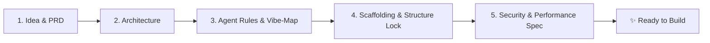

# 🚀 Project Initiator

> **Universal Pre-Flight Idea Discussion, Architectural Blueprinting & Scaffolding Lock Protocol for AI Agents.**  
> Built for **Google Antigravity**, with first-class support for **Claude Code**, **Cursor**, **Windsurf**, **Cline**, and any autonomous agent framework.

---

## 💡 What is Project Initiator?

When building apps with AI agents, models often jump straight into writing code on step 1 based on an underspecified prompt. The result is:
- Chaotic, unorganized directory structures
- Mismatched tech stacks and missing data models
- Code with security vulnerabilities and unindexed database bottlenecks
- Zero architectural persistence or change-impact tracking

**`project-initiator`** halts premature code generation. Before any feature code is written, it initiates a structured pre-flight alignment session that outputs five foundational artifacts in exact sequence:



---

## 🏛️ The Five Pre-Flight Pillars

### 1. `PRD.md` (Product Requirements Document & Idea Brief)
- Captures the complete project brief, vision, user personas, problem space, and success criteria.
- Establishes the MVP scope (Must-Haves) and strictly defines non-goals to prevent scope creep.
- Outlines the primary user journey flow with interactive Mermaid diagrams.

### 2. `ARCHITECTURE.md` (System Design & Technology Blueprint)
- Conducts technical stack discovery (Language, UI, API, Database, Caching, Queue).
- Recommends optimal architectures or adopts user preferences.
- Details component boundaries, data flow pipelines, schema contracts, and scalability boundaries.

### 3. `AGENTS.md` (Operational Guidelines & `/vibe-map` Integration)
- Defines binding rules for AI agents operating in the repository.
- **Mandatory `/vibe-map` Attachment:** Mandates running `/vibe-map impact` before modifying components and `/vibe-map update` after milestone completions.
- Enforces strict typing, complete implementations (zero TODOs/stubs), and automated test coverage.

### 4. Scaffolding & Structure Lock (`.structure_lock.json`)
- Based on `ARCHITECTURE.md`, creates the physical folder skeleton and starter files.
- **The Strict Permission Guard:** AI agents are locked strictly to the authorized directory layout.
- **Rule:** If an agent ever needs to create a new file or directory, or access external paths, **it must STOP and ask for explicit user permission first**.

### 5. `SECURITY_AND_PERFORMANCE.md` (Mandatory Guardrails & Budgets)
- Security specifications: Zero hardcoded secrets, mandatory `.env.example`, input validation schemas (Zod/Pydantic), SQL injection prevention, safe error masking.
- Performance budgets: Explicit latency thresholds (API P95 < 100ms), database index rules, memory limits, and frontend bundle caps (< 150KB gzip).

---

## 🌐 Cross-Platform Compatibility

| Agent Platform | Interactive Discovery Mode | Scaffolding & Lock Enforcement | Visual Maps & Blueprints |
| :--- | :--- | :--- | :--- |
| **Google Antigravity** | Native modal `ask_question` UI | Native file tools + `init_scaffold.py` + Artifacts | Mermaid rendered in chat & artifacts |
| **Claude Code** | Numbered interactive CLI menus | Shell execution + `.structure_lock.json` | Mermaid / ASCII terminal trees |
| **Cursor / Windsurf** | Interactive chat numbered prompts | Workspace files + rules enforcement | Webview Mermaid previews |
| **Cline / Roo-Code** | Interactive prompt iterations | Direct tool calls + lockfile verification | Mermaid markdown rendering |
| **GitHub Copilot CLI** | Interactive terminal prompt steps | Shell execution | Terminal trees |

---

## ⚡ Quickstart & Triggers

### Natural Language Triggers
- `/project-init` or `/project-initiator`
- *"Initialize a new project"*
- *"Start a new project for [idea]"*
- *"Help me plan and initiate my project before building"*
- *"Run project initiator"*

### Command Line Tools

```bash
# Initialize directories and lockfile
python3 scripts/init_scaffold.py --name "MyApp" --init

# Verify workspace integrity against .structure_lock.json
python3 scripts/init_scaffold.py --verify

# Grant permission to create a new authorized path
python3 scripts/init_scaffold.py --grant "src/services/billing.ts" --reason "User approved Stripe billing service"
```

---

## 📦 Installation

### One-Line Install (All Platforms)

```bash
./install.sh --all
```

### Platform-Specific Install

```bash
# Google Antigravity Global Skill
./install.sh --antigravity

# Claude Code Global Skill
./install.sh --claude

# Cursor Rules (.cursor/rules/project-initiator.mdc)
./install.sh --cursor

# Windsurf / Cascade
./install.sh --windsurf

# Attach to a specific workspace
./install.sh --project /path/to/my/project
```

---

## 📂 Repository Layout

```text
project_initiator/
├── SKILL.md                      # Main universal skill definition
├── README.md                     # Documentation & usage guide
├── install.sh                    # Universal multi-agent installer
├── LICENSE                       # MIT License
├── scripts/
│   ├── init_scaffold.py          # Scaffolding generator & lock verifier
│   └── check_lock.py             # Pre-commit & CI structural checker
├── templates/
│   ├── PRD.template.md           # Gold-standard PRD & Idea template
│   ├── ARCHITECTURE.template.md  # System design & architecture template
│   ├── AGENTS.template.md        # Agent rules with /vibe-map & lock rules
│   ├── SECURITY_AND_PERFORMANCE.template.md # Guardrails & budgets
│   └── structure_lock.template.json # JSON structure lock schema
└── references/
    ├── discovery_questions.md    # Phased interactive question sequences
    └── vibe_map_integration.md   # Blast-radius mapping integration guide
```

---

## 📜 License

MIT License. Crafted for elite autonomous software development.
