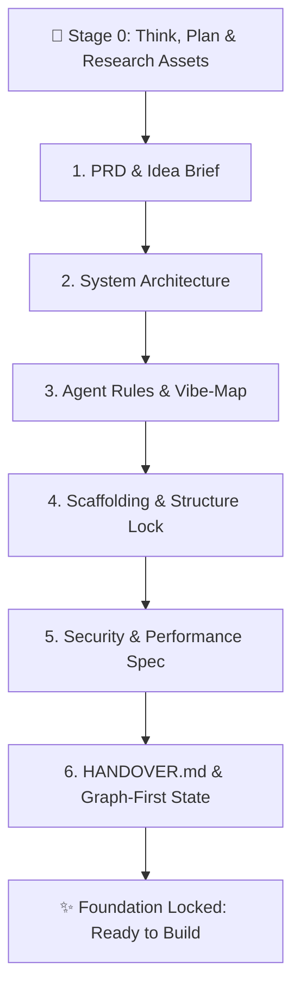

# 🚀 Project Initiator

> **Universal Pre-Flight Idea Discussion, Architectural Blueprinting & Scaffolding Lock Protocol for AI Agents.**  
> Built for **Google Antigravity**, with first-class support for **Claude Code**, **Cursor**, **Windsurf**, **Cline**, and any autonomous agent framework.

---

## 💡 What is Project Initiator?

When building apps with AI agents, models often jump straight into writing code on step 1 based on an underspecified prompt. The result is:
- Chaotic, unorganized directory structures
- Mismatched tech stacks and missing data models
- Code with security vulnerabilities and unindexed database bottlenecks
- Zero architectural persistence or change-impact tracking
- Ignored branding, missing visual assets, and neglected user constraints

**`project-initiator`** halts premature code generation. It enforces a **Think-First, Research-Deep, Build-Locked** methodology:



---

## 🏛️ The Pre-Flight Architecture

### 🧠 Stage 0: Collaborative Thinking, Planning & Asset Research
- **Thought Alignment & Discovery Planning:** The agent pauses, reflects, outlines an exploration roadmap, and asks all necessary foundational questions upfront.
- **Brand Guidelines & Visual Identity:** Captures brand voice, tone, color schemes, typography, and design aesthetics.
- **Visual Assets & Logos:** Solicits logos, icons, UI wireframes, Figma mockups, and image assets to attach to the project.
- **Reference Research:** Actively investigates reference URLs, competitor benchmarks, or repositories provided by the user using web search / URL tools.
- **Custom Requirements:** Uncovers unique domain logic, regulatory constraints (GDPR/HIPAA), and deployment environments.
- **Plan Synthesis:** Synthesizes all inputs and validates alignment with the user before generating documents.

### 1. `PRD.md` (Product Requirements Document & Idea Brief)
- Captures the complete project brief, vision, user personas, problem space, and success criteria.
- Establishes the MVP scope (Must-Haves) and strictly defines non-goals to prevent scope creep.
- Outlines the primary user journey flow with interactive Mermaid diagrams.
- Documents brand guidelines, visual assets, and reference URLs.

### 2. `ARCHITECTURE.md` (System Design & Technology Blueprint)
- Conducts technical stack discovery (Language, UI, API, Database, Caching, Queue).
- Recommends optimal architectures or adopts user preferences.
- Details component boundaries, data flow pipelines, schema contracts, and Mermaid system architecture diagrams.

### 3. `AGENTS.md` (Operational Guidelines & `/vibe-map` Integration)
- Defines binding rules for AI agents operating in the repository.
- **Mandatory `/vibe-map` Attachment ([Vibe-Map Repository](https://github.com/muchandresh/Vibe-Map)):** Mandates running `/vibe-map impact` before modifying components and `/vibe-map update` after milestone completions. If an agent does not have `/vibe-map`, it can be cloned directly via:
  ```bash
  git clone https://github.com/muchandresh/Vibe-Map.git .agents/skills/vibe-map
  ```
- Enforces strict typing, complete implementations (zero TODOs/stubs), and automated test coverage.

### 4. Scaffolding & Structure Lock (`.structure_lock.json`)
- Based on `ARCHITECTURE.md`, creates the physical folder skeleton and starter files.
- **The Strict Permission Guard:** AI agents are locked strictly to the authorized directory layout.
- **Rule:** If an agent ever needs to create a new file or directory, or access external paths, **it must STOP and ask for explicit user permission first**.

### 5. `SECURITY_AND_PERFORMANCE.md` (Mandatory Guardrails & Budgets)
- Security specifications: Zero hardcoded secrets, mandatory `.env.example`, input validation schemas (Zod/Pydantic), SQL injection prevention, safe error masking.
- Performance budgets: Explicit latency thresholds (API P95 < 100ms), database index rules, memory limits, and frontend bundle caps (< 150KB gzip).

### 6. `HANDOVER.md` (Cross-Model & Platform Continuity State)
- Eliminates context loss when switching between models (Gemini, Claude, GPT, Codex), accounts, or tools (`agy` CLI, Cursor, Windsurf).
- **The Map/Graph First Mandate:** Incoming agents MUST inspect `VIBE_MAP.md` / `codebase_map.json` before writing code.
- Outlines exact completed tasks, in-progress state, blockers, and an ordered priority punch list.

---

## 🌐 Cross-Platform Compatibility

| Agent Platform | Collaborative Planning & Discovery | Asset & Reference Research | Scaffolding & Lock Enforcement | Cross-Platform Handover |
| :--- | :--- | :--- | :--- | :--- |
| **Google Antigravity** | Native modal `ask_question` UI | `read_url_content`, Web Search, Artifacts | Native file tools + `init_scaffold.py` + Artifacts | `HANDOVER.md` + `/vibe-map` |
| **Claude Code** | Numbered interactive CLI menus | `WebFetch`, `curl`, local file inspection | Shell execution + `.structure_lock.json` | `HANDOVER.md` + `/vibe-map` |
| **Cursor / Windsurf** | Interactive chat numbered prompts | Chat URL attachments & local file reads | Workspace files + rules enforcement | `HANDOVER.md` + `/vibe-map` |
| **Cline / Roo-Code** | Interactive prompt iterations | Web browser tool / local file tools | Direct tool calls + lockfile verification | `HANDOVER.md` + `/vibe-map` |
| **OpenAI / ChatGPT / Codex** | Structured markdown Q&A rounds | Web browsing tool & image uploads | Canvas / Direct workspace files | `HANDOVER.md` + `/vibe-map` |

---

## ⚡ Quickstart & Triggers

### Natural Language Triggers
- `/project-init` or `/project-initiator`
- *"Initialize a new project"*
- *"Start a new project for [idea]"*
- *"Help me plan and initiate my project before building"*
- *"Run project initiator"*

### Command Line Tools

```bash
# Initialize directories and lockfile
python3 scripts/init_scaffold.py --name "MyApp" --init

# Verify workspace integrity against .structure_lock.json
python3 scripts/init_scaffold.py --verify

# Grant permission to create a new authorized path
python3 scripts/init_scaffold.py --grant "src/services/billing.ts" --reason "User approved Stripe billing service"
```

---

## 📦 Installation

### One-Line Install (All Platforms)

```bash
./install.sh --all
```

### Platform-Specific Install

```bash
# Google Antigravity Global Skill
./install.sh --antigravity

# Claude Code Global Skill
./install.sh --claude

# Cursor Rules (.cursor/rules/project-initiator.mdc)
./install.sh --cursor

# Windsurf / Cascade
./install.sh --windsurf

# Attach to a specific workspace
./install.sh --project /path/to/my/project
```

---

## 📜 License

MIT License. Crafted for elite autonomous software development.
