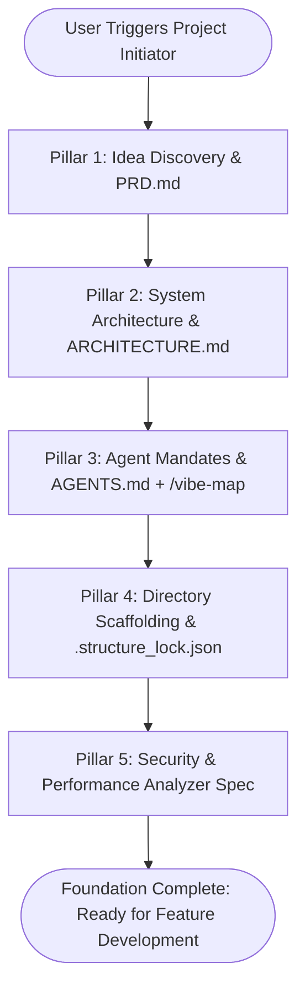

# 🚀 Project Initiator

> **An Antigravity-centric, cross-agent universal pre-flight protocol for initializing projects with rigorous architectural alignment, strict scaffolding locks, and proactive guardrails before a single line of business logic is written.**

---

## 🧭 Overview & Mission

The most common failure mode in AI-assisted software engineering is **Premature Implementation Disease**:
- The model starts writing code immediately based on an ambiguous 2-sentence prompt.
- It invents random file paths, scatters utilities across arbitrary folders, and creates circular dependencies.
- It changes direction halfway through because the core architecture, data model, or scope was never agreed upon.
- It exposes security vulnerabilities, ignores performance budgets, and leaves behind orphaned files.

**`project-initiator`** enforces an ironclad **Pre-Flight Discovery Protocol**. Before touching any production application code, it guides the user through an interactive idea alignment session and constructs a five-pillar foundation:

1. **`PRD.md`**: Complete Product Requirements Document, core idea brief, user personas, MVP vs non-goals, and user journey flow.
2. **`ARCHITECTURE.md`**: High-level system design, technology stack evaluation & rationale, component boundaries, and data flow.
3. **`AGENTS.md`**: Operational rules for AI agents, subagent protocols, and mandatory attachment of the `/vibe-map` skill.
4. **Scaffolding & Structure Lock (`.structure_lock.json`)**: Pre-creation of all project directories and skeleton files, with a strict enforcement lock requiring explicit user permission before creating or accessing any new file/directory.
5. **`SECURITY_AND_PERFORMANCE.md`**: Non-negotiable security guardrails (OWASP, secrets handling, input sanitization) and performance latency/bundle budgets.

---

## 🌐 Universal Agent Compatibility

While deeply integrated with Antigravity native capabilities (`ask_question`, Artifacts, markdown links), `project-initiator` is **100% universal** and operates natively across all major agent environments:

| Platform | Interactive Discovery Mode | Scaffolding & Lock Enforcement | Architecture Visuals |
| :--- | :--- | :--- | :--- |
| **Google Antigravity** | Native modal `ask_question` UI | Native file tools + `init_scaffold.py` + Artifacts | Mermaid rendered in chat & artifacts |
| **Claude Code** | Numbered interactive CLI menus | Shell execution + `.structure_lock.json` | Mermaid / ASCII terminal trees |
| **Cursor / Windsurf** | Interactive chat numbered prompts | Workspace files + rules enforcement | Webview Mermaid previews |
| **Cline / Roo-Code** | Interactive prompt iterations | Direct tool calls + lockfile verification | Mermaid markdown rendering |
| **OpenAI / ChatGPT** | Structured markdown Q&A rounds | Direct file output generation | Canvas / Markdown visual trees |

---

## ⚡ Natural Language Triggers & Commands

Activate this skill whenever the user asks for:
- `/project-init` or `/project-initiator`
- `!project-init` or `!init`
- *"Initialize a new project"*
- *"Start a new project for [idea]"*
- *"Help me plan and initiate my project before building"*
- *"Run project initiator"*
- *"Idea discussion setup for a new app"*
- *"Setup project architecture and scaffolding"*

---

## 🔄 The 5-Pillar Pre-Flight Execution Protocol

When `project-initiator` is triggered, follow these 5 steps in **exact sequential order**. **DO NOT skip steps, and DO NOT start writing feature code until all 5 steps are complete.**



---

### 💡 Pillar 1: Idea Discovery & PRD (`PRD.md`)

Conduct a focused interview to define the project scope. 

1. **Discovery Questions** (Use `ask_question` on Antigravity, or numbered prompt on other platforms):
   - **Core Value Proposition:** What is the core problem being solved, and for whom?
   - **Target Persona:** Who will use this tool/product daily?
   - **Must-Have MVP Scope:** What are the 3–5 non-negotiable features for v1.0?
   - **Explicit Non-Goals:** What are we strictly NOT building initially to avoid bloat?
   - **Success Criteria:** What metric or milestone defines success?

2. **Generate `PRD.md`**:
   - Synthesize user answers into the project root using the standard template:
   - Include Executive Summary, User Personas, User Journey Diagram (Mermaid), MVP Feature Matrix, and Scope Boundaries.
   - Present the created file as a clickable link: [PRD.md](file:///PRD.md).

---

### 🏗️ Pillar 2: Technical Architecture (`ARCHITECTURE.md`)

Collaborate on the technical design. The model must provide expert recommendations tailored to the project's requirements while soliciting user preferences.

1. **Architectural Questions**:
   - **Language & Runtime:** TypeScript / Python / Go / Rust? (Model explains trade-offs).
   - **Interface Layer:** CLI / Next.js / React / Headless Service?
   - **Persistence & State:** SQLite / Postgres / Redis / File-based?
   - **External Dependencies:** APIs, SDKs, or cloud services needed?

2. **Generate `ARCHITECTURE.md`**:
   - System Architecture Diagram (`mermaid`).
   - Chosen Tech Stack with explicit rationales for each decision.
   - Module boundaries (`src/core`, `src/api`, `src/models`, etc.).
   - Data flow walkthrough and core schema definitions.
   - Present the created file as a clickable link: [ARCHITECTURE.md](file:///ARCHITECTURE.md).

---

### 🤖 Pillar 3: Agent Operational Mandates (`AGENTS.md`)

Define the operational rules, quality standards, and subagent protocols for all AI agents working on this project.

1. **Mandatory `/vibe-map` Integration Rule**:
   - Every agent MUST attach or initialize `/vibe-map` in the repository (`.agents/skills/vibe-map/` or global).
   - Before modifying existing components, agents MUST run `/vibe-map impact "<target_file>"` to assess blast radius.
   - After completing major architectural milestones, agents MUST run `/vibe-map update` to refresh the visual mental model and JSON dependency graph.

2. **Generate `AGENTS.md`**:
   - Include the Strict File Structure Lock Mandate.
   - Include the `/vibe-map` attachment and usage protocol.
   - Include code quality standards: complete implementations (zero stubs/TODOs), strict typing, and test coverage requirements.
   - Present the created file as a clickable link: [AGENTS.md](file:///AGENTS.md).

---

### 🔒 Pillar 4: Directory Scaffolding & Immutable Structure Lock

Based on `ARCHITECTURE.md`, establish the physical workspace before writing business logic.

1. **Directory & File Skeleton Creation**:
   - Create all agreed-upon directories and initial file placeholders using file tools or by running:
     ```bash
     python3 scripts/init_scaffold.py --root . --name "<ProjectName>" --init
     ```
2. **Generate `.structure_lock.json`**:
   - Register all authorized directories and authorized files in `.structure_lock.json`.
   - Set `"lock_active": true` and `"require_explicit_user_permission": true`.

3. **THE IRONCLAD PERMISSION GUARD**:
   > [!CRITICAL]
   > **THE MODEL IS STRICTLY CONFINED TO THE AUTHORIZED FILE STRUCTURE.**
   > - The model/agent MUST ONLY work within the pre-created directories and files.
   > - If at ANY time during future development the model needs to create a new file or directory, or access paths outside the structure lock, it **MUST ALWAYS STOP AND ASK FOR EXPLICIT USER PERMISSION FIRST**.
   > - Example prompt: *"I need to create `src/services/webhook.ts` to support stripe callbacks. Do you approve creating this file?"*
   > - Only after user confirmation may the model create the file and register it in `.structure_lock.json` via:
   >   ```bash
   >   python3 scripts/init_scaffold.py --grant "src/services/webhook.ts" --reason "User approved stripe webhook"
   >   ```

---

### 🛡️ Pillar 5: Security & Performance Analyzer (`SECURITY_AND_PERFORMANCE.md`)

Codify non-negotiable security guardrails and performance budgets specific to the project.

1. **Security Rules**:
   - Zero hardcoded secrets; mandatory `.env` + `.env.example` setup.
   - Strict input validation schemas on all inputs.
   - SQL/Command injection prevention (parameterized queries only).
   - Rate limiting, safe error masking, and CORS/CSRF configurations.

2. **Performance Budgets**:
   - Latency thresholds (P95 < 100ms for APIs, < 150ms for CLI).
   - Database query budgets (< 20ms, mandatory indexes for lookup columns).
   - Memory limits and streaming for large payloads.
   - Bundle size caps (< 150KB gzip for frontend web bundles).

3. **Generate `SECURITY_AND_PERFORMANCE.md`**:
   - Produce the complete spec and audit checklist.
   - Present the created file as a clickable link: [SECURITY_AND_PERFORMANCE.md](file:///SECURITY_AND_PERFORMANCE.md).

---

## 🎯 Verification & Handoff

Once all 5 pillars are established:
1. Run structural integrity verification:
   ```bash
   python3 scripts/init_scaffold.py --verify
   ```
2. Display a polished summary table to the user:
   - [PRD.md](file:///PRD.md)
   - [ARCHITECTURE.md](file:///ARCHITECTURE.md)
   - [AGENTS.md](file:///AGENTS.md)
   - [.structure_lock.json](file:///.structure_lock.json)
   - [SECURITY_AND_PERFORMANCE.md](file:///SECURITY_AND_PERFORMANCE.md)
3. Prompt the user: *"All pre-flight foundations are locked and verified. Would you like to begin implementing Milestone 1 from the PRD?"*
