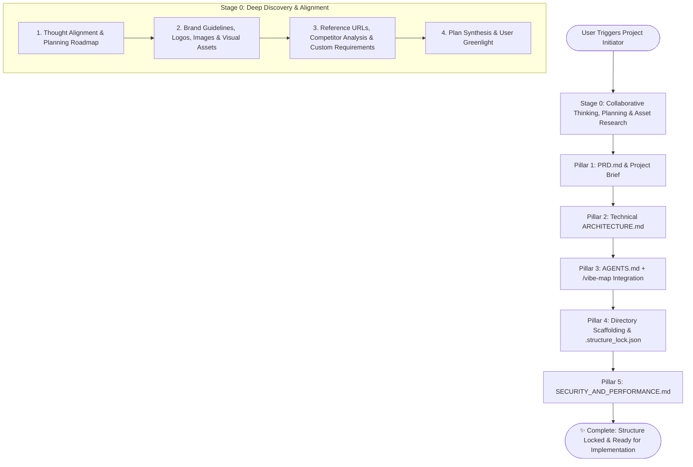

# 🚀 Project Initiator

> **An Antigravity-centric, cross-agent universal pre-flight protocol for initializing projects with deep planning, collaborative research, architectural alignment, strict scaffolding locks, and proactive guardrails before a single line of business logic is written.**

---

## 🧭 Overview & Philosophy

The most common failure mode in AI-assisted software engineering is **Premature Implementation Disease**:
- The model starts generating code immediately based on a vague prompt without pausing to think or plan.
- It fails to ask about branding, design aesthetic, reference sites, or existing logos and assets.
- It invents random file paths, scatters utilities across arbitrary folders, and creates circular dependencies.
- It skips security best practices, ignores performance budgets, and leaves behind technical debt.

**`project-initiator`** halts premature code generation. It enforces a **Think-First, Research-Deep, Build-Locked** methodology:
1. **Pause & Plan Collaboratively:** The agent thinks through the domain, plans the exploration roadmap with the user, and asks all necessary scoping questions.
2. **Deep Research & Asset Discovery:** The agent solicits brand guidelines, logos, images, design systems, reference URLs, and specific business constraints.
3. **5-Pillar Artifact Generation:** Once all inputs and research are consolidated and confirmed, it generates `PRD.md`, `ARCHITECTURE.md`, `AGENTS.md` (with `/vibe-map`), Scaffolding + `.structure_lock.json`, and `SECURITY_AND_PERFORMANCE.md`.

---

## 🌐 Universal Agent Compatibility

While deeply integrated with Antigravity native capabilities (`ask_question`, Artifacts, markdown links, `read_url_content`), `project-initiator` is **100% universal** and operates natively across all major agent ecosystems:

| Platform | Collaborative Planning & Discovery | Asset & Reference Research | Scaffolding & Lock Enforcement |
| :--- | :--- | :--- | :--- |
| **Google Antigravity** | Native modal `ask_question` UI | `read_url_content`, Web Search, Artifacts | Native file tools + `init_scaffold.py` + Artifacts |
| **Claude Code** | Numbered interactive CLI menus | `WebFetch`, `curl`, local file inspection | Shell execution + `.structure_lock.json` |
| **Cursor / Windsurf** | Interactive chat numbered prompts | Chat URL attachments & local file reads | Workspace files + rules enforcement |
| **Cline / Roo-Code** | Interactive prompt iterations | Web browser tool / local file tools | Direct tool calls + lockfile verification |
| **OpenAI / ChatGPT** | Structured markdown Q&A rounds | Web browsing tool & image uploads | Canvas / Direct workspace files |

---

## ⚡ Natural Language Triggers & Commands

Activate this skill whenever the user asks for:
- `/project-init` or `/project-initiator`
- `!project-init` or `!init`
- *"Initialize a new project"*
- *"Start a new project for [idea]"*
- *"Help me plan and initiate my project before building"*
- *"Run project initiator"*
- *"Idea discussion setup for a new app"*
- *"Setup project architecture and scaffolding"*

---

## 🔄 The Complete Pre-Flight Execution Pipeline



---

### 🧠 Stage 0: Collaborative Thinking, Planning & Deep Asset Research

> [!IMPORTANT]
> **DO NOT RUSH TO GENERATE FILES.** The agent must think critically, communicate its plan, and deeply research all user requirements first.

#### 1. Think & Plan Collaboratively with the User
- **Reflect & Align:** Before generating any document, outline a clear discovery plan: *"Here is how we'll shape this project together: First we'll explore brand and reference assets, then nail the technical stack, lock the directory scaffolding, and set security rules."*
- **Ask All Foundational Questions Upfront:** Use `ask_question` in Antigravity or numbered interactive prompts to clarify the core idea, problem statement, and primary personas.

#### 2. Brand Guidelines & Visual Assets
- **Brand Identity:** Ask if the user has an existing brand name, brand voice, tone (e.g., sleek minimalist, neo-brutalist, retro terminal, enterprise-clean), or color palette.
- **Logos & Media:** Inquire if the user has logos, SVG icons, moodboards, mockups, or image assets to attach or reference in the project.
- **Asset Placement:** If the user provides local files or URLs, note their paths and verify where they should be housed (e.g. `assets/` or `public/`).

#### 3. Reference URLs & Specific Custom Requirements
- **Inspiration URLs / Competitors:** Ask: *"Do you have reference websites, apps, or GitHub repositories whose UX, design, or architecture you want to emulate?"*
  - If URLs are provided, use `read_url_content` or Web Search to inspect them, extract design patterns, and summarize key takeaways.
- **Specific Custom Requirements:** Ask about special business logic, proprietary formulas, domain rules, regulatory compliance (e.g. GDPR, HIPAA, SOC2), or deployment targets (Docker, AWS, Vercel, bare-metal).

#### 4. Consolidate & Confirm
- Present a concise **Discovery Synthesis**:
  - Summary of the idea & problem space
  - Selected brand tone & color scheme
  - Attached assets and reference inspirations
  - Non-negotiable custom requirements
- Confirm with the user: *"Does this capture your vision accurately? Ready to generate the 5 foundational pillars?"*

---

### 💡 Pillar 1: Product Requirements Document (`PRD.md`)

Synthesize the confirmed vision into a comprehensive project brief:

1. **Contents of `PRD.md`**:
   - **Executive Summary & Big Idea:** One-sentence hook and value proposition.
   - **Problem Statement & Pain Points:** Who experiences this friction and why existing tools fail.
   - **Target Personas & User Journey:** Step-by-step user path visualized with a **Mermaid sequence diagram**.
   - **Feature Scope Matrix:** Strict Phase 1 MVP (Must-Haves) vs. Phase 2 Post-MVP vs. **Explicit Non-Goals** (preventing scope creep).
   - **Brand Guidelines & Visual Assets:** Color codes, typography, logo paths, and reference mockups.
   - **Reference & Competitor Research:** Key takeaways from analyzed reference URLs.
   - **Custom Requirements & Constraints:** Business logic rules and regulatory boundaries.
2. **Deliverable:** Write [`PRD.md`](file:///PRD.md) to the project root and provide a clickable link.

---

### 🏗️ Pillar 2: Technical Architecture (`ARCHITECTURE.md`)

Design the technical foundation based on the PRD:

1. **Architectural Discussion & Stack Selection**:
   - Present recommendations for Language/Runtime, Frontend UI, Backend API, Database, and Caching.
   - Explain trade-offs clearly and validate user preferences.
2. **Contents of `ARCHITECTURE.md`**:
   - **System Architecture Diagram:** Rendered in `mermaid` (Client ➔ API/Gateway ➔ Services ➔ Persistence/Cache).
   - **Tech Stack Rationale Table:** Every choice justified with pros/cons.
   - **Canonical Directory Layout:** Exact directory and module boundaries.
   - **Data Flow & Execution Pipeline:** End-to-end trace from request to database commit.
   - **Data Models & Schema Contracts:** Strongly typed TypeScript interfaces or Python models.
3. **Deliverable:** Write [`ARCHITECTURE.md`](file:///ARCHITECTURE.md) to the project root and provide a clickable link.

---

### 🤖 Pillar 3: Agent Operational Mandates (`AGENTS.md`)

Establish strict rules of engagement for all AI agents and subagents touching this repository:

1. **Mandatory `/vibe-map` Integration**:
   - Ensure the `/vibe-map` skill is attached or accessible in the workspace.
   - **Pre-Change Impact Rule:** Before refactoring or modifying components, agents MUST run:
     ```bash
     /vibe-map impact "<target_file>"
     ```
   - **Post-Milestone Sync Rule:** After completing any major feature or architectural milestone, agents MUST run:
     ```bash
     /vibe-map update
     ```
2. **Code Quality & Testing Directives**:
   - 100% complete implementations (no stub functions, placeholder mockups, or dangling `// TODO` comments).
   - Strict typing across all files (no implicit `any`).
   - Mandatory unit or integration tests for every core capability under `tests/`.
3. **Deliverable:** Write [`AGENTS.md`](file:///AGENTS.md) to the project root and provide a clickable link.

---

### 🔒 Pillar 4: Directory Scaffolding & Immutable Structure Lock

Physically construct the project workspace before writing any business logic:

1. **Scaffold Creation**:
   - Create all designated directories and starter files as specified in `ARCHITECTURE.md`.
   - Run the scaffolding utility:
     ```bash
     python3 scripts/init_scaffold.py --root . --name "<ProjectName>" --init
     ```
2. **The Immutable Structure Lock (`.structure_lock.json`)**:
   - Registers all authorized directories and files.
   - Activates strict permission enforcement.

3. **THE IRONCLAD PERMISSION GUARD**:
   > [!CRITICAL]
   > **THE MODEL IS STRICTLY CONFINED TO THE AUTHORIZED FILE STRUCTURE.**
   > - The model/agent MUST ONLY work within the pre-created directories and files.
   > - If at ANY time during future development the model needs to create a new file or directory, or access paths outside the structure lock, it **MUST ALWAYS STOP AND ASK FOR EXPLICIT USER PERMISSION FIRST**.
   > - Prompt template: *"I recommend creating `src/services/billing.ts` to handle subscription webhooks. Do you approve creating this file?"*
   > - Only after user confirmation may the model create the file and register it in `.structure_lock.json` via:
   >   ```bash
   >   python3 scripts/init_scaffold.py --grant "src/services/billing.ts" --reason "User approved subscription webhook"
   >   ```

---

### 🛡️ Pillar 5: Security & Performance Analyzer (`SECURITY_AND_PERFORMANCE.md`)

Establish non-negotiable security guardrails and performance budgets:

1. **Security Guardrails**:
   - Zero hardcoded secrets; mandatory `.env` + `.env.example` setup.
   - Schema validation (Zod, Pydantic) required on all external inputs.
   - SQL & command injection prevention (parameterized queries, safe process execution).
   - Rate limiting, safe error masking, and CORS/CSRF configurations.
2. **Performance Budgets**:
   - Latency thresholds: API P95 < 100ms, CLI startup < 150ms.
   - Database queries: < 20ms, mandatory indexes on lookup columns.
   - Memory limits and streaming for large files.
   - Bundle size caps (< 150KB gzip for web bundles).
3. **Deliverable:** Write [`SECURITY_AND_PERFORMANCE.md`](file:///SECURITY_AND_PERFORMANCE.md) to the project root and provide a clickable link.

---

## 🎯 Verification & Handoff

Once all 5 pillars are established:
1. Run structural integrity verification:
   ```bash
   python3 scripts/init_scaffold.py --verify
   ```
2. Display a polished summary table to the user:
   - [PRD.md](file:///PRD.md)
   - [ARCHITECTURE.md](file:///ARCHITECTURE.md)
   - [AGENTS.md](file:///AGENTS.md)
   - [.structure_lock.json](file:///.structure_lock.json)
   - [SECURITY_AND_PERFORMANCE.md](file:///SECURITY_AND_PERFORMANCE.md)
3. Prompt the user: *"All pre-flight foundations are locked and verified. Would you like to begin implementing Milestone 1 from the PRD?"*
