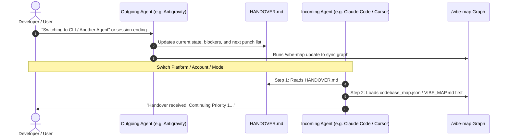

# 🤝 Agent Handover Protocol Guide

> **Seamless state transfer across models, accounts, CLI environments, and agentic platforms.**

---

## 🎯 The Problem Handover Solves

Developers frequently switch contexts when working with AI:
- Switching models (e.g., Gemini 2.5 Pro ➔ Claude 3.7 Sonnet ➔ Codex)
- Switching interfaces (e.g., Antigravity Web UI ➔ `agy` CLI ➔ terminal bash)
- Switching agent platforms (e.g., Antigravity ➔ Claude Code ➔ Cursor ➔ Windsurf)
- Switching accounts or starting new sessions when context limits are reached

Without a standardized handover mechanism, the new agent:
1. Has zero memory of past decisions or why certain files exist.
2. Wastes precious tokens reading dozens of files haphazardly.
3. Often recreates or undoes work that was already completed.
4. Breaks the directory structure by introducing redundant folders.

---

## ⚡ The Handover Lifecycle

---

## 📜 Golden Rules for Handover

### 1. Outgoing Agent Rules (Preparing the Handover)
Before closing a session, switching models, or when the user says *"prepare handover"*:
1. Update `HANDOVER.md` with:
   - What features/modules were completed during the session.
   - Exact current state of in-progress code and any uncommitted changes.
   - An ordered punch list of the top 3-5 immediate next steps.
2. Run `/vibe-map update` to ensure `vibe-map-out/codebase_map.json` and `vibe-map-out/VIBE_MAP.md` reflect all latest edits.
3. Log the handoff session in the Handover Changelog table.

### 2. Incoming Agent Rules (Receiving the Handover)
When an agent starts in a repo containing `HANDOVER.md`:
1. **Map / Graph First Mandate:** Read `HANDOVER.md` and immediately inspect `vibe-map-out/VIBE_MAP.md` or `vibe-map-out/codebase_map.json`.
2. **Never Guess:** Follow the punch list in `HANDOVER.md` instead of inventing new tasks.
3. **Respect Structure Lock:** Check `.structure_lock.json`. Do not create new files without explicit user consent.
