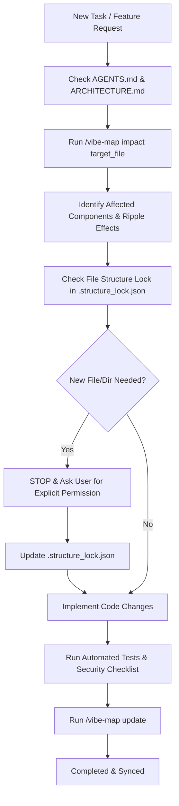

# 🗺️ Vibe-Map Integration Guide for Project Initiator

> **Official Repository:** [https://github.com/muchandresh/Vibe-Map](https://github.com/muchandresh/Vibe-Map)

---

## 🎯 What is Vibe-Map?

If an AI agent or developer is unfamiliar with **Vibe-Map**, it is a codebase cartographer and architectural visualizer tailored for rapid vibe coding. It deeply scans directories using AST parsing and structural heuristics to generate:
1. **Interactive Mental Models:** Visual component hierarchies and layered user journeys (Frontend ➔ API ➔ Domain ➔ Database).
2. **Machine-Readable Maps:** Structured `codebase_map.json` for AI agents.
3. **Living Architectural Docs:** Auto-generated `VIBE_MAP.md` and zero-dependency interactive canvas `vibe_map.html`.
4. **Blast-Radius Impact Analyzer:** Upstream and downstream ripple effect calculations before changing code.

---

## 📥 How to Install / Fetch Vibe-Map if Missing

If the current environment or workspace does not have `/vibe-map` installed:

### Option 1: Attach Directly into Project Workspace (Recommended)
```bash
mkdir -p .agents/skills
git clone https://github.com/muchandresh/Vibe-Map.git .agents/skills/vibe-map
```

### Option 2: Install Globally for Antigravity
```bash
git clone https://github.com/muchandresh/Vibe-Map.git ~/.gemini/config/skills/vibe-map
```

### Option 3: Install for Claude Code or Other Platforms
```bash
mkdir -p ~/.claude/skills
git clone https://github.com/muchandresh/Vibe-Map.git ~/.claude/skills/vibe-map
```

---

## 🔗 How Project Initiator Hooks into `/vibe-map`

### 1. Pre-Flight Skill Attachment
During Step 3 of the initialization protocol (`AGENTS.md`), `project-initiator` automatically:
- Checks if `/vibe-map` is available globally (`~/.gemini/config/skills/vibe-map/` or local `.agents/skills/vibe-map/`).
- If missing, clones it from `https://github.com/muchandresh/Vibe-Map`.
- Configures `AGENTS.md` with explicit rules mandating that all future agents utilize `/vibe-map`.

### 2. Operational Workflows Mandated for Future Agents



### 3. Key `/vibe-map` Commands for Agents

- **Impact Analysis (Pre-edit):**
  ```bash
  /vibe-map impact "src/core/engine.ts"
  ```
  *Predicts blast radius and dependent files before making modifications.*

- **Component & Dependency Tracing:**
  ```bash
  /vibe-map trace "src/api/controller.ts" "src/models/user.ts"
  ```
  *Visualizes the execution path and data contract between layers.*

- **Map Synchronization (Post-edit):**
  ```bash
  /vibe-map update
  ```
  *Regenerates `vibe-map-out/codebase_map.json` and `vibe-map-out/VIBE_MAP.md` after implementing new features.*

---

## 🐞 4. Post-Handover Debugging: Version & File History

When an agent switches in and the user asks to debug a new error or unexpected regression:
1. **Version History & Structural Snapshots:**  
   `vibe-map` maintains structural state across updates. Incoming agents can compare the current structure against previous snapshots to see which files were recently created, deleted, or refactored.
2. **Finding the Root Cause Fast:**  
   Instead of searching through all files blindly:
   - Identify the file reported in the error stack trace.
   - Run `/vibe-map trace "<entry_file>" "<error_file>"` to understand what called it.
   - Run `/vibe-map impact "<error_file>"` to verify what other functions broke as a ripple effect.
3. **Differential Analysis:**  
   Combine `git diff` with `codebase_map.json` to see how changes in interfaces or function signatures broke upstream callers.
