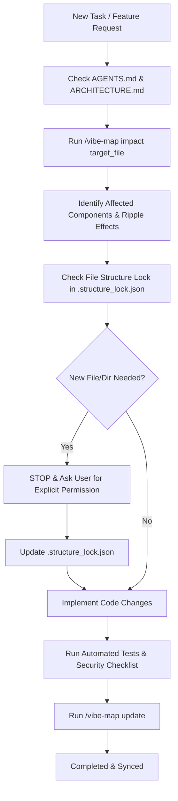

# 🗺️ Vibe-Map Integration Guide for Project Initiator

## Overview

A core tenet of the `project-initiator` protocol is **architectural persistence and blast-radius awareness**. While `project-initiator` defines the initial intent, boundaries, and structure lock before development begins, the `/vibe-map` skill maintains the living mental model of the codebase as features are actively built.

---

## 🔗 How Project Initiator Hooks into `/vibe-map`

### 1. Pre-Flight Skill Attachment
During Step 3 of the initialization protocol (`AGENTS.md`), `project-initiator` automatically:
- Checks if `/vibe-map` is available globally (`~/.gemini/config/skills/vibe-map/` or in the agent environment).
- Attaches or symlinks `/vibe-map` into `.agents/skills/vibe-map/` within the target project.
- Configures `AGENTS.md` with explicit rules mandating that all future agents utilize `/vibe-map`.

### 2. Operational Workflows Mandated for Future Agents



### 3. Key `/vibe-map` Commands for Agents

- **Impact Analysis (Pre-edit):**
  ```bash
  /vibe-map impact "src/core/engine.ts"
  ```
  *Predicts blast radius and dependent files before making modifications.*

- **Component & Dependency Tracing:**
  ```bash
  /vibe-map trace "src/api/controller.ts" "src/models/user.ts"
  ```
  *Visualizes the execution path and data contract between layers.*

- **Map Synchronization (Post-edit):**
  ```bash
  /vibe-map update
  ```
  *Regenerates `vibe-map-out/codebase_map.json` and `vibe-map-out/VIBE_MAP.md` after implementing new features.*
