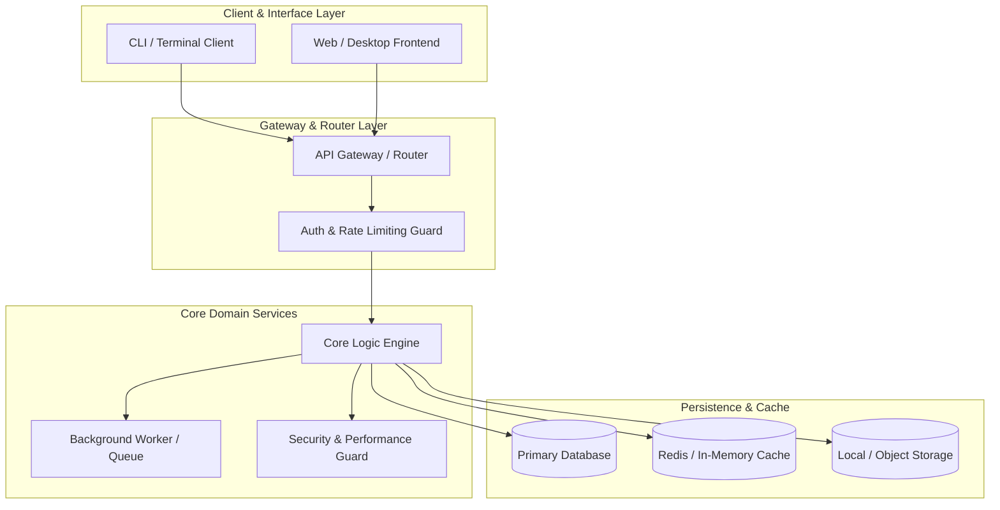

# 🏗️ Technical Architecture & System Design

> **Project Name:** {{PROJECT_NAME}}  
> **Architecture Version:** 1.0.0  
> **Last Updated:** {{DATE}}  
> **Status:** Approved  

---

## 🏛️ 1. High-Level System Architecture



---

## ⚙️ 2. Technology Stack Selection & Rationale

| Layer | Chosen Technology | Version / Spec | Key Rationale / Alternatives Considered |
| :--- | :--- | :--- | :--- |
| **Language** | {{e.g. TypeScript / Python / Go}} | {{e.g. 5.x / 3.12}} | {{Why chosen over alternatives}} |
| **Frontend UI** | {{e.g. React / Next.js / Vanilla}} | {{Version}} | {{Performance, DX, ecosystem}} |
| **Backend API** | {{e.g. FastAPI / Express / Hono}} | {{Version}} | {{Throughput, type safety, ergonomics}} |
| **Persistence** | {{e.g. PostgreSQL / SQLite / DuckDB}}| {{Version}} | {{ACID compliance, embedded, relational}} |
| **Caching / State** | {{e.g. Redis / Zustand / Redux}} | {{Version}} | {{Low latency, simplicity}} |
| **Testing** | {{e.g. Vitest / Pytest}} | {{Version}} | {{Speed, mocking support}} |
| **Packaging** | {{e.g. Docker / uv / pnpm}} | {{Version}} | {{Reproducibility, deterministic builds}} |

---

## 📂 3. Canonical Project Structure Blueprint

```text
{{PROJECT_ROOT}}/
├── .agents/                      # Agent instruction files, skills, and protocols
│   └── skills/                   # Attached agent skills (e.g. vibe-map, project-initiator)
├── AGENTS.md                     # Strict Agent rules & operational mandates
├── ARCHITECTURE.md               # This architectural source of truth
├── PRD.md                        # Product requirements & project brief
├── SECURITY_AND_PERFORMANCE.md   # Security, audit, and performance constraints
├── .structure_lock.json          # Enforced directory lock manifest
├── src/                          # Application source code
│   ├── core/                     # Domain logic & business rules
│   ├── api/                      # Interfaces, controllers & routes
│   ├── models/                   # Schemas, types & database entities
│   ├── services/                 # External service integrations
│   └── utils/                    # Reusable helper functions
├── tests/                        # Comprehensive test suite
│   ├── unit/
│   └── integration/
└── config/                       # Application configuration & environments
```

---

## 🔄 4. Data Flow & Execution Pipeline

1. **Request Intake:** Input received via CLI/API, parsed through validation schema.
2. **Pre-Flight Guards:** Rate limit, permission, and parameter sanitization checks.
3. **Domain Execution:** Core engine processes logic deterministically.
4. **State Mutation:** Database transaction begins and commits.
5. **Event Emission / Side Effects:** Asynchronous tasks queued if necessary.
6. **Response Dispatch:** Clean serialized response emitted to consumer.

---

## 📑 5. Data Models & Schema Contracts

```typescript
// Core Entity Schema Contract Example
export interface CoreEntity {
  id: string;             // UUIDv4 or ULID
  createdAt: string;      // ISO 8601 UTC
  updatedAt: string;      // ISO 8601 UTC
  status: 'active' | 'pending' | 'archived';
  payload: Record<string, unknown>;
}
```

---

## ⚡ 6. Scalability, Concurrency & Failure Modes

- **Concurrency Model:** {{e.g. Asyncio event loop / Node event loop / Worker threads}}
- **Failure Recovery:** {{Graceful retry backoffs, circuit breakers, error fallbacks}}
- **State Boundaries:** {{Stateless API nodes with distributed cache vs local embedded DB}}
