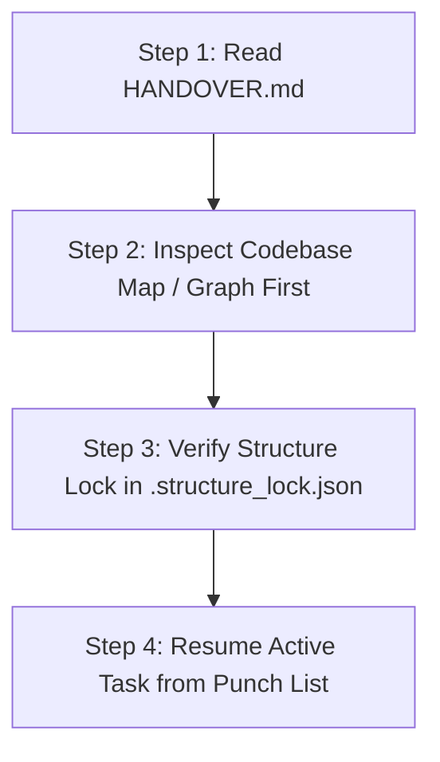

# 🤝 AGENT HANDOVER — Cross-Model & Cross-Platform State Protocol

> **Project Name:** {{PROJECT_NAME}}  
> **Last Updated:** {{DATE}}  
> **Last Active Model / Platform:** {{CURRENT_AGENT_OR_PLATFORM}}  
> **Next Target Agent / Platform:** Universal (Antigravity IDE / CLI, Claude Code, Cursor, Windsurf, Codex, etc.)  
> **Handover Status:** ACTIVE & READY FOR PICKUP  

---

## ⚡ INCOMING AGENT: READ THIS FIRST (FIRST ACTION MANDATE)

Welcome, incoming agent! Before executing commands or modifying any code, you **MUST** follow this 4-step onboarding sequence:

1. **MAP / GRAPH FIRST MANDATE:**  
   Do **NOT** guess, hallucinate, or perform blind file searches. Immediately load the architectural mental model:
   - Check `vibe-map-out/VIBE_MAP.md` or machine JSON `vibe-map-out/codebase_map.json`.
   - If `/vibe-map` is available, run `/vibe-map` or `/vibe-map impact "<target_file>"` to visualize component connections.
   - If a graph tool (like `graphify`) exists, query the project graph.
2. **RESPECT THE STRUCTURE LOCK:**  
   You are strictly bound to the authorized directories in [`.structure_lock.json`](file:///.structure_lock.json). Do **NOT** create new files or directories without asking the user for explicit permission first!
3. **ALIGN WITH THE SPECS:**  
   Review [PRD.md](file:///PRD.md), [ARCHITECTURE.md](file:///ARCHITECTURE.md), [AGENTS.md](file:///AGENTS.md), and [SECURITY_AND_PERFORMANCE.md](file:///SECURITY_AND_PERFORMANCE.md).

---

## 📍 1. Current State & Mission Snapshot

- **Project Core Mission:** {{One punchy sentence describing what this project is and does}}
- **Current Milestone:** {{e.g. Milestone 1: Core Engine & CLI Scaffolding}}
- **Overall Completion:** {{e.g. 35% complete - MVP Phase}}

---

## ✅ 2. What Has Been Done So Far

*Chronological record of verified implementations:*
- [x] Pre-flight discovery completed (PRD, Architecture, Agents, Scaffolding, Security & Performance locked).
- [x] Initial directory skeleton and structure lock initialized.
- [x] Attached `/vibe-map` skill ([Vibe-Map Repo](https://github.com/muchandresh/Vibe-Map)) to `.agents/skills/vibe-map`.
- [x] {{Completed Feature / Module A}}
- [x] {{Completed Feature / Module B}}

---

## 🚧 3. In-Progress Work & Active Context

- **Task being worked on right before handoff:**  
  {{Describe exact file, function, or bug being addressed}}
- **Current Branch / Working Directory:** `{{BRANCH}}` (Clean / Uncommitted changes noted below)
- **Known Blockers / Edge Cases:**  
  {{Any tricky dependencies, pending API keys, or known test failures}}

---

## 🎯 4. Immediate Next Steps (Priority Punch List)

Incoming agent, pick up work directly from this ordered list:

1. [ ] **Immediate Priority 1:** {{Exact next action to perform}}
2. [ ] **Priority 2:** {{Subsequent task}}
3. [ ] **Priority 3:** {{Subsequent task}}
4. [ ] Run tests and verify zero regressions.
5. [ ] Run `/vibe-map update` to refresh the codebase map.

---

## 🐞 5. Post-Handover Debugging & History Diagnostics

If you are asked to debug an error, crash, or regression that appeared after this handover:
1. **Version & History Inspection:**  
   Inspect `vibe-map-out/` snapshots and git diffs to see the exact files, functions, or imports modified right before the bug manifested.
2. **Blast Radius Analysis:**  
   Run `/vibe-map impact "<modified_file>"` to identify all downstream consumers that could be receiving broken contracts or unhandled exceptions.
3. **Execution Path Tracing:**  
   Run `/vibe-map trace "<entry_file>" "<target_file>"` to visualize how data flows between the failure point and caller.

---

## 📜 6. Handover Session Changelog

| Timestamp | Outgoing Agent / Model | Incoming Agent / Model | Summary of Work Completed | Next Agent Goal |
| :--- | :--- | :--- | :--- | :--- |
| {{DATE}} | Antigravity (Project Initiator) | {{TARGET_AGENT}} | Completed initial pre-flight initialization and locked structure | Begin implementation of Milestone 1 |
