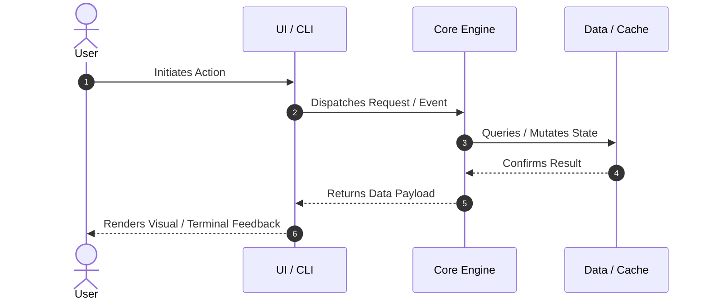

# 📄 Product Requirements Document (PRD) & Project Brief

> **Project Name:** {{PROJECT_NAME}}  
> **Status:** Draft / Approved / In-Progress  
> **Date Initiated:** {{DATE}}  
> **Target Audience:** {{AUDIENCE}}  
> **Lead Architect / Initiator:** {{LEAD}}  

---

## 💡 1. Executive Summary & Core Idea

### 1.1 The Big Idea
- What is this project in one punchy sentence?
- What is the primary value proposition?

### 1.2 Problem Statement & Pain Points
- What specific problem or friction does this project address?
- Who currently experiences this pain and how is it solved today?
- Why is existing tooling/software insufficient?

### 1.3 Vision & Ultimate Outcome
- How does the world look when this project succeeds?
- What is the long-term potential beyond MVP?

---

## 🎯 2. Goals & Success Metrics

### 2.1 Primary Business / User Goals
1. Goal 1: {{Specific, measurable target}}
2. Goal 2: {{Specific, measurable target}}
3. Goal 3: {{Specific, measurable target}}

### 2.2 Key Performance Indicators (KPIs)
| Metric | Baseline | Target (MVP) | Target (v1.0) |
| :--- | :--- | :--- | :--- |
| Active Users / Tasks | N/A | {{Target}} | {{Target}} |
| Execution Latency / Speed | N/A | < {{Time}}ms | < {{Time}}ms |
| Error Rate / Crash Frequency | N/A | < 0.1% | < 0.01% |

---

## 👥 3. Target Personas & User Journeys

### Persona A: {{Persona Name}}
- **Role / Profile:** {{e.g. Solo Developer / Enterprise Team / Casual User}}
- **Key Motivations:** {{Speed, reliability, simplicity, power}}
- **Frustrations:** {{Complexity, slow setups, fragmentation}}

### Core User Journey Flow

---

## 🧩 4. Feature Specifications & Scope Matrix

### 4.1 Phase 1: MVP (Must-Haves)
*Features required for initial launch. Non-negotiable.*
- [ ] **F1.0 - Core Engine / Baseline Capability:** Description
- [ ] **F1.1 - User Input & Interaction:** Description
- [ ] **F1.2 - Primary Output / Value Delivery:** Description
- [ ] **F1.3 - Error Handling & User Guidance:** Description

### 4.2 Phase 2: Post-MVP (Nice-to-Haves)
- [ ] **F2.0 - Automation & Batch Processing**
- [ ] **F2.1 - Enhanced Visuals / Dashboards**
- [ ] **F2.2 - Third-party Integrations & Webhooks**

### 4.3 Out of Scope (Strict Non-Goals)
*Explicitly excluded to avoid scope creep during development.*
- ❌ Feature A
- ❌ Feature B
- ❌ Feature C

---

## 🎨 5. Brand Guidelines, Visual Assets & Aesthetic Direction

### 5.1 Brand Identity & Voice
- **Brand Voice / Tone:** {{e.g. Minimal, playful, cybernetic, enterprise-clean}}
- **Primary Color Palette:** {{Primary: #HEX, Secondary: #HEX, Accent: #HEX, Background: #HEX}}
- **Typography:** {{Headings Font, Body Font, Monospace Code Font}}

### 5.2 Attached Visual Assets & References
- **Logos / Icons:** {{File paths or URLs to logos, favicons, app icons}}
- **Reference Mockups / Wireframes:** {{Figma links, screenshot paths, whiteboard diagrams}}
- **Inspirational References:** {{Links to apps/sites with desired vibe or interactions}}

---

## 🔬 6. Research Findings & Competitor Analysis

| Reference / Competitor | Key Strengths / Inspiration | Weaknesses / Differentiators |
| :--- | :--- | :--- |
| **Reference A** | {{What they do exceptionally well}} | {{What we will do better / simpler}} |
| **Reference B** | {{Visual or architectural takeaway}} | {{Gaps in their implementation}} |

---

## ⚙️ 7. Specific Custom Requirements & Constraints

- **Custom Business Rules:** {{Specific domain rules, workflows, or validation}}
- **Compliance & Regulatory:** {{GDPR, HIPAA, SOC2, or specific data retention}}
- **Technical Assumptions:** {{e.g., Python 3.10+, Node 20+, Docker}}
- **Platform Constraints:** {{OS limitations, memory limits, browser support}}
